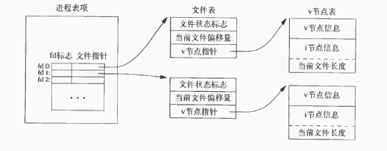
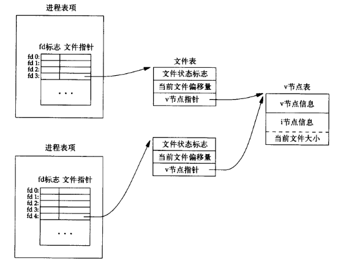
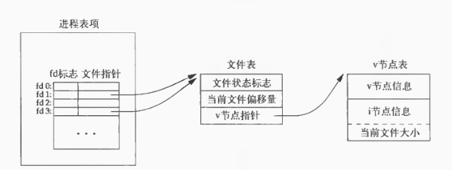

- [文件I/O](#文件io)
  - [文件描述符](#文件描述符)
  - [函数open和close](#函数open和close)
  - [函数creat](#函数creat)
  - [函数lseek](#函数lseek)
  - [函数read](#函数read)
  - [函数write](#函数write)
  - [I/O的效率](#io的效率)
  - [文件共享](#文件共享)
  - [原子操作](#原子操作)
  - [函数dup和dup2](#函数dup和dup2)
  - [函数sync、fsync和fdatasync](#函数syncfsync和fdatasync)
  - [函数fcntl](#函数fcntl)
  - [函数ioctl](#函数ioctl)
  - [/dev/fd](#devfd)
  - [总结](#总结)
  

# 文件I/O
在Unix系统中涉及到的I/O函数主要包括：打开文件、读文件、写文件等等。系统中的大多数文件IO涉及到的五个函数为：open、read、write、lseek和close。
## 文件描述符
对内核而言，所有打开的文件都通过文件描述符引用。文件描述符是一个整数，当打开一个文件或新建一个文件时，内核向进程返回一个文件描述符。当读写文件时，使用open或create返回的文件描述符会标识该文件，将其参数返回给read或write。
## 函数open和close
函数open和openat可以用来打开或创建一个文件。

```c
#include <fcntl.h>

int open(const char *path, int oflag, ...);
int openat(int fd, const *path, int oflag, ...);
```
其中fd为文件描述符，path参数是要打开或创建文件的名字，oflag是此函数的多个选项。

由open和openat函数返回的文件描述符一定是最小的未使用的文件描述符。fd参数吧open和openat函数区分开，共有三种情况：
+ path参数指定的是绝对路径名，在这种情况下，fd参数被忽略，openat函数相当于open函数
+ path参数指定的是相对路径名，fd参数指出了相对路径名在文件系统的开始地址。fd参数是通过打开相对路径名所在的目录来获取。
+ path参数指定了相对路径名，fd参数具有特殊值AT_FDCWD。在这种情况下，路径名在当前工作目录中获取，openat在操作是上与open类似。

## 函数creat
也可调用creat函数创建一个新的文件。

```c
int creat(const char *path, mode_t mode);
```
creat的一个不足之处就是他以只写方式打开所创建的文件。
## 函数lseek
每个打开文件都有一个与其关联的当前文件偏移量，它通常是一个非负整数，用以度量从文件开始处计算的字节数。通常文件的读写操作都是从当前的文件偏移量处开始，并使偏移量增加所读写的字节数。系统默认情况，打开一个文件时，除非指定O_AOOEND选项，否则偏移量都是0。调用lseek可以显示为一个打开文件设置偏移量。
```c
#include <unistd.h>

off_t lseek(int fd, off_t offset, int where); 
```

## 函数read
调用read函数从打开文件中读取数据。

```c
#include <unistd>
ssize_t read(int fd , void *buf , size_t nbytes);
```
如果读取成功，则返回读到的字节数，如已经达到了文件的尾端，则返回0。

## 函数write
调用write函数想打开文件写数据。

```c
ssize_t write(int fd, const void *buf, size_t nbytes);
```

## I/O的效率
文件IO的效率与缓冲区大小有一定的关系，大多数文件系统为改善性能都采用某种预读技术。当检测到正在进行顺序读取时，系统会师徒读入比应用所要求的的更多的数据，并假想应用很快会读这些数据。预读的效果与缓冲区的大小有关，缓冲区长度小于32字节时的耗时与缓冲区非常大的时间耗时几乎一样。


## 文件共享
Unix系统支持在不同进程间共享打开文件。在介绍dup函数之前先要了解这种共享行为和内核用于IO的数据结构，在内核中主要有三种数据结构表示打开文件，他们之间的关系决定了在文件共享方面一个进程对另一个进程可能产生的影响。

+ 进程表：进程表包含文件描述符和指向一个文件表的指针
+ 文件表：文件表保管文件状态标志（读写等），当前文件偏移量和指向该文件v节点表的指针。
+ v节点表：每个打开的文件都有V节点结构。v节点包含可文件类型和此文件进行各种操作函数的指针。对大多数文件而言，v节点还包括了该文件的i节点，这些信息是在打开文件时从磁盘上读入内存的，所以文件相关的信息都是随时可用的。
  
> Linux没有v节点，而是使用了通用的i节点结构。虽然两种实现有所不同，但是在概念上v节点和i节点是相同的。两者都指向文件系统特有的节点结构



如果两个独立的进程各自打开了同一个文件，相关的流程如下图所示。进程1在fd3上打开该文件，进程2在fd4上打开该文件，打开该文件的各个进程都获得各自的一个文件表象，但对一个给定的文件只有一个v节点表项。




## 原子操作
假定有两个独立的进程A和B对同一个文件进行追加写数据操作，AB先获取文件末尾的偏移量1500，然后B首先对文件写入100字节数据，此时文件末尾实际偏移量为1600，但是A在写入数据之前并不知道，A从1500处写入数据就会覆盖B的数据。

问题出在进程对文件写入数据分为两个过程，先定位到文件尾端，再写入。它使用了两个分开的函数。解决问题的办法就是使这两个操作对于其他进程而言成为一个原子操作。
> Unix为这样的操作提供了一种原子操作的办法，即在打开文件时设置O_APPEND标志。


**函数pread和pwrite**

```c
#include<unistd.h>
ssize_t pread(int fd, void *buf, size_t nbytes, off_t offset);

ssize_t pwrite(int fd, void *buf, size_t nbytes, off_t offset);
```
> 调用pread相当于调用lseek后调用read， 但是pread又与这种顺序调用有重要区别：首先调用pread时，无法终端其定位操作和读操作。其次不会更新当前文件的偏移量

一般而言，原子操作值得是由多步组成的一个操作，如果该操作的原子地执行，则要么执行完所有的步骤，要么一步也不执行，不可能只执行一部分。
## 函数dup和dup2
下面两个函数都可以来复制一个现有的文件描述符
```c
#include<unistd.h>

int dup(int fd)//返回当前可用文件描述符的最小值

int dup2(int fd, int fd2)//指定fd2为新的描述符，若fd2已打开则将其关闭，若fd=fd2，则返回fd2而不关闭
```
这些函数返回的新文件描述符与参数fd共享一个文件表项，如下图所示。



## 函数sync、fsync和fdatasync
传统的Unix实现在内核中设有缓冲区告诉缓存或页告诉缓存，大多是磁盘IO都通过缓冲区进行。当我们将数据写入文件时，内核通常先将数据复制到缓冲区中然后排入队列，晚些时候再写入磁盘。这种方式通常被称为延迟写入，为了保证磁盘上市级文件系统与缓冲区中内容的一致性，Unix系统提供了sync、fsync和fdatasync三个函数。

```c
#include<unistd.h>
int fsync(int fd);
int fdatasync(int fd);

void sync(void);
```
sync通常只是将所有修改过的块缓冲区排入写队列，然后就返回，它并不等待时机写磁盘操作结束。  
通常，称为update的系统守护进程周期性地调用sync函数，这就保证了定期清空内核的块缓冲区。命令sync（1）也调用sync函数。  
fsync函数支队由文件描述符fd指定的一个文件起作用，并且等待写磁盘操作结束才返回。fsync可用于数据库这样的应用程序，这种应用程序需要确保修改过的块立即写到磁盘上。  
fdatasync类似于fsunc但他只影响文件的数据部分，而除数据外fsync还会同步更新文件属性。

## 函数fcntl
fcntl用于改变已打开的文件属性

```c
int fcntl(int fd, int cmd, ... /* int arg */);

```
函数主要有五种功能：
1. 复制一个已有的描述符
2. 获取设置文件描述符标志
3. 获取设置文件状态标志
4. 获取设置异步IO所有权
5. 获取设置记录锁

实例：第一个参数指定文件描述符，并对于该描述符打印其所选择的文件标志说明。

```c
#include <fcntl.h>
#include <stdio.h>

int main(int argc, char *argv[])
{
	int val;

	if (argc != 2)
		printf("usage :a.out <description>\n");
	if (val = fcntl(atio(argv[1]), F_GETFL, 0) < 0)
		printf("fcntl error for fd %d", atoi(argv[1]));
	switch (val & O_ACCMODE)
	{
	case O_WRONLY:
		printf("write only\n");
		break;
	case O_RDONLY:
		printf("read only\n");
		break;
	case O_RDWR:
		printf("read write\n");
		break;
	default:
		printf("Unknow access mode\n");
		break;
	}

	if (val & O_APPEND)
		printf(",append");
	if (val & O_NONBLOCK)
		printf(", nonblocking");
	if (val & O_SYNC)
		printf(", synchronous");
	return 0;
}
```

在时间修改文件描述符标志或文件状态标志时必须谨慎，先要获得现在的标志位，然后按照期望修改它，最后设置新的标志位。
## 函数ioctl
ioctl函数一直是IO操作的杂物箱。IO操作函数通常都能用ioctl表示，终端IO是使用ioctl函数最多的地方。
## /dev/fd
较新的系统都提供名为/dev/fd的目录，其目录项是名为0、1、2等的文件。打开文件/dev/fd/n 等效于复制描述符n。
## 总结
本文档说明了Unix系统提供的基本IO函数。因为read和write都在内核执行，所以称这些函数为不带缓冲的IO函数。在只使用read和write情况下，不同的长度的buffer会对读写文件时间的有不同的影响。  
