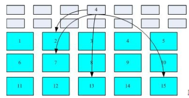

# 文件和目录

## 前言
本文档描述文件系统的其他特征和文件的性质。

## stat、fstat、fstatat和lstat

```c
#include <sys/stat.h>

int stat(pathname, buf);
int fstat(fd,buf);
int lstat(pathname , buf);
int fstatat(fd, pathname, buf, flag);

//所有四个函数的返回值成功返回0 出错返回-1
```

给定pathname时，以上四个函数都是获取文件的相关信息结构，但是各有不同之处。

+ stat函数将返回与此命名文件有关的信息结构
+ fstat函数获得已在描述符fd上打开的文件信息
+ lstat与stat类似，当文件为符号链接时，lstat会获取符号链接的文件信息，而不是符号链接引用的文件信息
+ fstatat为一个相对于当前打开目录的路径名返回文件统计信息


所有获取的信息都会在buf中返回，函数成功后会填充由buf指向的结构，该结构包括以下信息。

```c
struct stat {
_dev_t st_dev; //设备号
_ino_t st_ino; //inode number
unsigned short st_mode; // 文件类型
short st_nlink; 
short st_uid;
short st_gid;
_dev_t st_rdev;//特殊文件设备号
_off_t st_size;
time_t st_atime;// access time
time_t st_mtime;// modification time
time_t st_ctime;// status change time
};

```

使用stst函数最多的地方就是ls -l命令，可以获取关于文件的所有信息。

## 文件类型

Unix系统的大多数文件是普通文件或目录，也包括一些其他类型的文件。

+ 普通文件。这是最常用的文件类型，这种文件包含了某种形式的数据。
+ 目录文件。这种文件包含了其他文件的名字以及指向与这些文件有关信息的指针。对一个目录具有读权限的任意进程都可以读取该该目录的内容，但只有内核可以直接写目录文件。进程补习使用本章介绍的函数才能更改目录。
+ 块特殊文件。这种类型的文件提供对设备（如磁盘）带缓冲的访问，每次访问以固定长度为单位进行。
+ 字符特殊文件。这种类型的文件提供对设备不带缓冲的访问，每次访问的长度可变。系统中的所有设备要么是字符特殊文件，要么是块特殊文件。
+ FIFO。这种类型文件用于进程间通信，有事也称为命名管道。
+ 套接字Socket。这种类型文件用于进程间的网络通信。套接字也可用在一台宿主机上进程间的通信。
+ 符号链接。这种类型的文件指向另一个文件。

文件类型的信息包含在stat结构体的st_mode成员中,可以通过stat中的宏判断文件类型。

```c
#define	S_ISDIR(m)	(((m) & S_IFMT) == S_IFDIR)
#define	S_ISFIFO(m)	(((m) & S_IFMT) == S_IFIFO)
#define	S_ISCHR(m)	(((m) & S_IFMT) == S_IFCHR)
#define	S_ISBLK(m)	(((m) & S_IFMT) == S_IFBLK)
#define	S_ISREG(m)	(((m) & S_IFMT) == S_IFREG)
```

## 文件访问权限
每个文件有9个访问权限位。

```shell
S_IRUSR     用户读
S_IWUSR     用户写
S_IXUSR     用户执行

S_IRGRP     组读
S_IWGRP     组写
S_IXGRP     组执行

S_IROHR     其他读
S_IWOHR     其他写
S_IXOHR     其他执行
```

进程每次打开、创建或者删除一个文件时，内核就进行文件访问的权限测试，而这种测试就设计文件所有者、进程的有效ID、和进程的附属组ID。

## 函数access和faccessat

```c
#include<unistd.h>

int assess(pathname, mode)
int facccessat(fd, pathname, mode , flag)
//成功返回1，失败返回-1
```
access 和 faccessat用与进程使用设置用户ID和组ID功能作为另一个用户运行时，测试是否具有访问权限，两者是按实际用户ID和实际组ID进行访问权限测试的。


## 函数umask
umask函数为进程设置文件模式创建屏蔽字，并返回之前的值。

```c
mode_t umask(mode_t cmask);

//返回之前文件模式创建屏蔽字
```

## 函数chmod、fchmod和fchmodat
这三个函数使我们可以更改现有文件的访问权限。

```
#include<sys/stat.h>

int chmod(pathname, mode);

int fchmod(fd, mode);

int fchmodat(fd, pathname, flag)
```

+ chmod函数在指定的文件上进行操作
+ fchmod在已经打开的文件上进行操作
+ fchmodat函数与chmod函数在下面两种情况下是相同的
  + pathname为绝对路径
  + fd参数取值为AT_FDCWD且参数pathname为相对路径

## 文件长度
stat结构成员st_size 表示以字节为单位的文件长度。此字段只对普通文件、目录文件和符号链接有意义。

+ 普通文件长度可以为0，开始读长度为0文件时，将得到文件结束指示。
+ 目录的文件长度通常是一个数的整数倍
+ 符号链接的长度是在文件名中的实际字节数

## 文件截断

有时我们需要在文件尾端处截取一些数据以缩短文件。将一个文件长度截断为0是一个特例，在打开文件时使用O_TRUENC标志即可。

```c
include<unistd.h>

int truncate(pathname , length);
int ftruncate(fd, length);

```
这两个函数将一个现有的文件长度截断为length。如过该文件以前的长度大于length，则超过length以外的数据就不能再访问，如果以前的长度小于length就在文件末尾补齐0。

## ext2 文件系统

文件系统通常会将这两部份的数据分别存放在不同的区块，权限与属性放置到 inode 中，至于实际数据则放置到 data block 区块中。另外，还有一个超级区块（superblock）会记录整个文件系统的整体信息，包括 inode 与 block 的总量、使用量、剩余量等。

每个inode 和 block 都有编号，置于这三个数据的意义可以简略说明如下：

+ superblock：记录此 filesystem 的整体信息，包括inode/block的总量、使用量、剩余量，以及文件系统的格式与相关信息等；
+ inode：记录文件的属性，一个文件占用一个inode，同时记录此文件的数据所在的 block号码；
+ block：实际记录文件的内容，若文件太大时，会占用多个 block 

如下图所示，文件系统先格式化出 inode 与block 的区块，假设某一个文件的属性与权限数据是放置到 inode 4 号（下图较小方格内），而这个 inode 记录了文件数据的实际放置点为 2, 7, 13, 15 这四个 block 号码，此时我们的操作系统就能够据此来排列磁盘的读取顺序，可以一口气将四个 block 内容读出来。



Linux 的文件除了原有的数据内容外，还含有非常多的权限与属性，这些权限与属性是为了保护每个使用者所拥有数据的隐密性。inode 的内容在记录文件的权限与相关属性，至于 block 区块则是在记录文件的实际内容。而且文件系统一开始就将 inode 与 block 规划好了，除非重新格式化（或者利用 resize2fs 等指令变更文件系统大小），否则 inode 与 block 固定后就不再变动。

## link 、unlink、remove和rename函数

任何一个文件可以有多个目录项指向其i节点。创建一个指向现有文件的连接方法是使用link函数。

```c
#include <unistd.h>

int link(const char *existingpath, const char *newpath);
```

此函数创建一个新目录项newpath，它引用现有的文件existingpath。如果newpath已经存在，则返回出错。  

为了删除一个现有的目录项，可以调用unlink函数。

```c
#include <unistd.h>

int unlink(const char *pathname);
```

