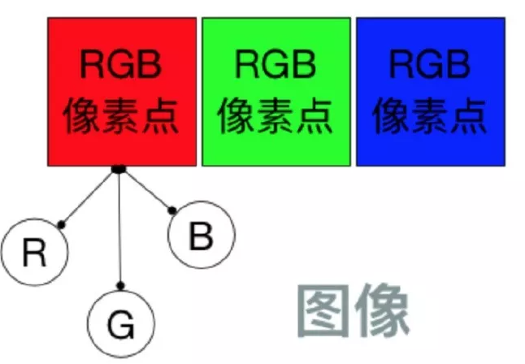
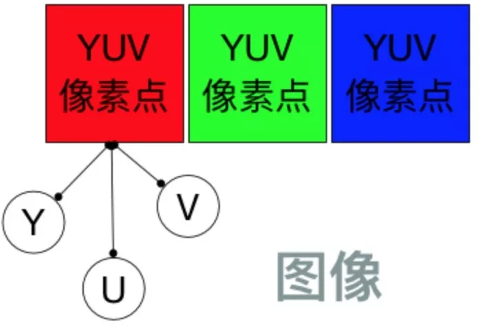
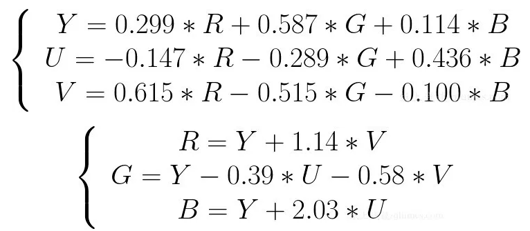
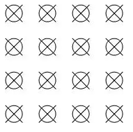
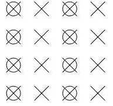
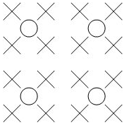
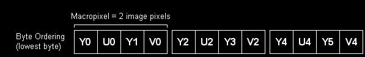
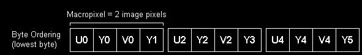
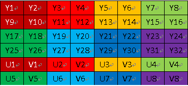
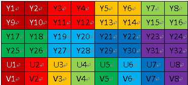

# 基础概述
YUV 是一种颜色编码方法，和它等同的还有 RGB 颜色编码方法。

## RGB颜色编码
RGB 三个字母分别代表了 红（Red）、绿（Green）、蓝（Blue），这三种颜色称为 三原色，将它们以不同的比例相加，可以产生多种多样的颜色。

在图像显示中，一张 1280 * 720 大小的图片，就代表着它有 1280 * 720 个像素点。其中每一个像素点的颜色显示都采用 RGB 编码方法，将 RGB 分别取不同的值，就会展示不同的颜色。

RGB 图像中，每个像素点都有红、绿、蓝三个原色，其中每种原色都占用 8 bit，也就是一个字节，那么一个像素点也就占用 24 bit，也就是三个字节。

一张 1280 * 720 大小的图片，就占用 1280 * 720 * 3 / 1024 / 1024 = 2.63 MB 存储空间。

## YUV 颜色编码
YUV 颜色编码采用的是 明亮度 和 色度 来指定像素的颜色。
其中，Y 表示明亮度（Luminance、Luma），而 U 和 V 表示色度（Chrominance、Chroma）。
而色度又定义了颜色的两个方面：色调和饱和度。
使用 YUV 颜色编码表示一幅图像，它应该下面这样的。

和 RGB 表示图像类似，每个像素点都包含 Y、U、V 分量。但是它的 Y 和 UV 分量是可以分离的，如果没有 UV 分量一样可以显示完整的图像，只不过是黑白的。

对于 YUV 图像来说，并不是每个像素点都需要包含了 Y、U、V 三个分量，根据不同的采样格式，可以每个 Y 分量都对应自己的 UV 分量，也可以几个 Y 分量共用 UV 分量。

## RGB 到 YUV 的转换

对于图像显示器来说，它是通过 RGB 模型来显示图像的，而在传输图像数据时又是使用 YUV 模型，这是因为 YUV 模型可以节省带宽。因此就需要采集图像时将 RGB 模型转换到 YUV 模型，显示时再将 YUV 模型转换为 RGB 模型。

RGB 到 YUV 的转换，就是将图像所有像素点的 R、G、B 分量转换到 Y、U、V 分量。

# YUV 采样格式

YUV 图像的主流采样方式有如下三种:
+ YUV 4:4:4 采样
+ YUV 4:2:2 采样
+ YUV 4:2:0 采样

## YUV 4:4:4 采样
YUV 4:4:4 采样，意味着 Y、U、V 三个分量的采样比例相同，因此在生成的图像里，每个像素的三个分量信息完整，都是 8 bit，一个像素点大小也就是3字节。

其中，Y 分量用叉表示，UV 分量用圆圈表示。

> 举个例子 ：
> 假如图像像素为：[Y0 U0 V0]、[Y1 U1 V1]、[Y2 U2 V2]、[Y3 U3 V3]
> 那么采样的码流为：Y0 U0 V0 Y1 U1 V1 Y2 U2 V2 Y3 U3 V3 
> 最后映射出的像素点依旧为 [Y0 U0 V0]、[Y1 U1 V1]、[Y2 U2 V2]、[Y3 U3 V3] 

可以看到这种采样方式的图像和 RGB 颜色模型的图像大小是一样，并没有达到节省带宽的目的，当将 RGB 图像转换为 YUV 图像时，也是先转换为 YUV 4:4:4 采样的图像。

## YUV 4:2:2 采样

YUV 4:2:2 采样，意味着 UV 分量是 Y 分量采样的一半，Y 分量和 UV 分量按照 2 : 1 的比例采样。如果水平方向有 10 个像素点，那么采样了 10 个 Y 分量，而只采样了 5 个 UV 分量。

其中，Y 分量用叉表示，UV 分量用圆圈表示。

采样的码流映射为像素点，还是要满足每个像素点有 Y、U、V 三个分量。但是可以看到，第一和第二像素点公用了 U0、V1 分量，第三和第四个像素点公用了 U2、V3 分量，这样就节省了图像空间。

> 一张 1280 * 720 大小的图片，在 YUV 4:2:2 采样时的大小为：（1280 * 720 * 8 + 1280 * 720 * 0.5 * 8 * 2）/ 8 / 1024 / 1024 = 1.76 MB 。

可以看到 YUV 4:2:2 采样的图像比 RGB 模型图像节省了三分之一的存储空间，在传输时占用的带宽也会随之减少。

## YUV 4:2:0 采样
YUV 4:2:0 采样，并不是指只采样 U 分量而不采样 V 分量。而是指，在每一行扫描时，只扫描一种色度分量（U 或者 V），和 Y 分量按照 2 : 1 的方式采样。比如，第一行扫描时，YU 按照 2 : 1 的方式采样，那么第二行扫描时，YV 分量按照 2:1 的方式采样。对于每个色度分量来说，它的水平方向和竖直方向的采样和 Y 分量相比都是 2:1 

举个例子 ：  
假设图像像素为：  
[Y0 U0 V0]、[Y1 U1 V1]、 [Y2 U2 V2]、 [Y3 U3 V3]  
[Y5 U5 V5]、[Y6 U6 V6]、 [Y7 U7 V7] 、[Y8 U8 V8]  
那么采样的码流为：Y0 U0 Y1 Y2 U2 Y3 Y5 V5 Y6 Y7 V7 Y8
其中，每采样过一个像素点，都会采样其 Y 分量，而 U、V 分量就会间隔一行按照 2 : 1 进行采样。  
最后映射出的像素点为:  
[Y0 U0 V5]、[Y1 U0 V5]、[Y2 U2 V7]、[Y3 U2 V7]  
[Y5 U0 V5]、[Y6 U0 V5]、[Y7 U2 V7]、[Y8 U2 V7]  

从映射出的像素点中可以看到，四个 Y 分量是共用了一套 UV 分量，而且是按照 2*2 的小方格的形式分布的，相比 YUV 4:2:2 采样中两个 Y 分量共用一套 UV 分量，这样更能够节省空间。

一张 1280 * 720 大小的图片，在 YUV 4:2:0 采样时的大小为：

>（1280 * 720 * 8 + 1280 * 720 * 0.25 * 8 * 2）/ 8 / 1024 / 1024 = 1.32 MB 。

可以看到 YUV 4:2:0 采样的图像比 RGB 模型图像节省了一半的存储空间，因此它也是比较主流的采样方式。

# YUV 存储格式
YUV 存储格式有两种：
+ planar平面格式
  + 指连续存储所有像素点的YUV分量
+ packed打包格式
  + 指每个像素点的YUV分量是连续交替存储的

根据采样方式和存储格式的不同，就有了多种 YUV 格式。这些格式主要是基于 YUV 4:2:2 和 YUV 4:2:0 采样。

常见的基于 YUV 4:2:2 采样的格式有
+ YUYV
+ UYVY
+ YUV 422P格式

常见的基于YUV 4:2:0 采样的格式有

|                | YUV 4:2:0 采样 | YUV 4:2:0 采样 |
|----------------|----------------|----------------|
| YUV 420P 类型  | YV12 格式      | YU12 格式      |
| YUV 420SP 类型 | NV12 格式      | NV21 格式      |

## 基于 YUV 4:2:2 采样的格式
YUV 4:2:2 采样规定了 Y 和 UV 分量按照 2: 1 的比例采样，两个 Y 分量公用一组 UV 分量。

### YUYV 格式
YUYV个税是采用打包格式进行存储的，指每个像素点都采用Y分量，但是每隔一个像素采样它的UV分量。

Y0 和 Y1 公用 U0 V0 分量，Y2 和 Y3 公用 U2 V2 分量。

### UYVY 格式
UYVY 格式也是采用打包格式进行存储，它的顺序和 YUYV 相反，先采用 U 分量再采样 Y 分量，排列顺序如下：

### YUV 422P 格式
YUV 422P 格式，又叫做 I422，采用的是平面格式进行存储，先存储所有的 Y 分量，再存储所有的 U 分量，再存储所有的 V 分量。

## 基于 YUV 4:2:0 采样的格式

### YUV420SP 和 YUV420P 

YUV 420P 和 YUV 420SP 都是基于 Planar 平面模式 进行存储的，先存储所有的 Y 分量后， YUV420P 类型就会先存储所有的 U 分量或者 V 分量，而 YUV420SP 则是按照 UV 或者 VU 的交替顺序进行存储了。
#### YUV420SP

YU12 和 YV12 格式都属于 YUV 420P 类型，即先存储 Y 分量，再存储 U、V 分量，区别在于：YU12 是先 Y 再 U 后 V，而 YV12 是先 Y 再 V 后 U 。
#### YUV420P

NV12 和 NV21 格式都属于 YUV420SP 类型。它也是先存储了 Y 分量，但接下来并不是再存储所有的 U 或者 V 分量，而是把 UV 分量交替连续存储。  
NV12 是 IOS 中有的模式，它的存储顺序是先存 Y 分量，再 UV 进行交替存储。NV21 是 安卓 中有的模式，它的存储顺序是先存 Y 分量，在 VU 交替存储。

+ 参考1：<https://glumes.com/post/ffmpeg/understand-yuv-format/>
+ 参考2：<https://blog.csdn.net/sinat_29891353/article/details/100975238>