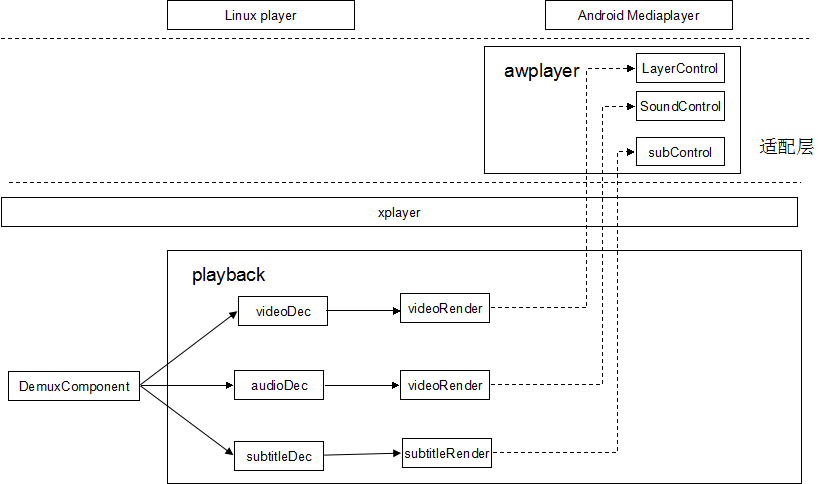
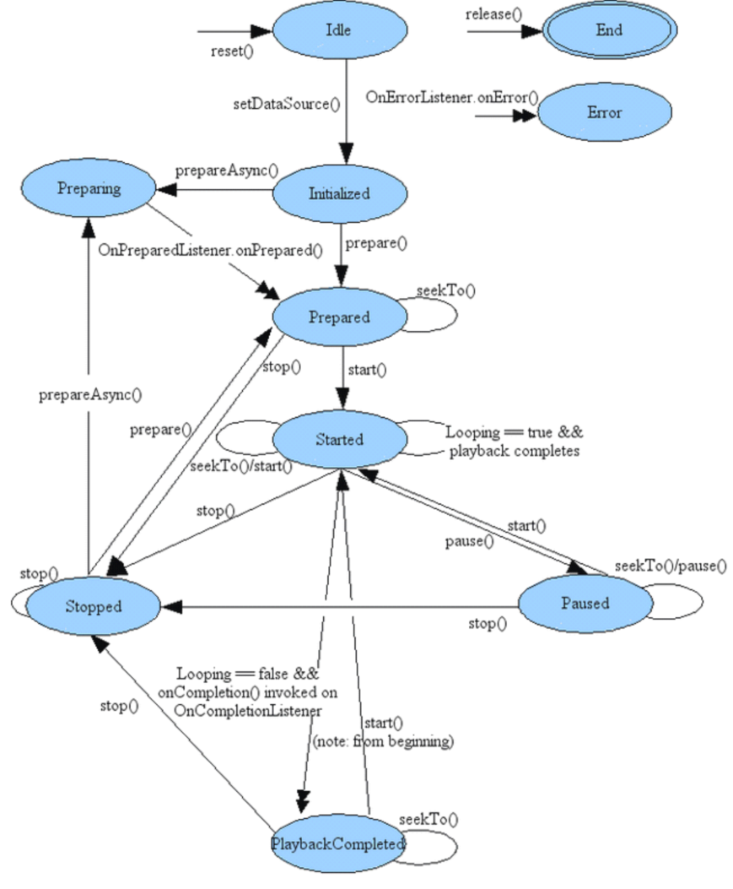

- [概述](#概述)
  - [编写目的](#编写目的)
  - [适用范围](#适用范围)
  - [相关人员](#相关人员)
  - [模块介绍](#模块介绍)
  - [模块功能介绍](#模块功能介绍)
  - [相关术语介绍](#相关术语介绍)
- [模块体系结构设计](#模块体系结构设计)
  - [整体框架](#整体框架)
  - [流程设计](#流程设计)
  - [接口函数](#接口函数)
  - [接口使用方法介绍](#接口使用方法介绍)
  - [注意事项](#注意事项)

# 概述
## 编写目的
设计音视频播放器模块的基本框架、内/外部接口、主要数据结构和流程。指导上层应用的开发、使用和后续维护。
## 适用范围
全志芯片适用CedarX中间件平台，包括Android和Linux
## 相关人员
开发和维护播放器模块的相关人员。
## 模块介绍
## 模块功能介绍
　　xplayer模块类似于播放中间件的作用，提供上层应用播放控制的API，方便上层实现播放器功能。
## 相关术语介绍
xplayer: 基础播放器模块，提供基本播放功能，上层可根据需求对接Android和Linux平台。

# 模块体系结构设计
## 整体框架

  
  xplayer模块设计初衷是提供一套跨平台、便于扩展的多媒体播放中间件。因此需要满足以下两点：
 1） 对上层屏蔽底层播控、流控以及解码等实现细节，提供一套标准接口共应用层调用；
 2）平台差异化需求（如音视频输出、字幕输出等）抽象成统一接口由上层实现，底层不需要关心上层是如何实现的。允许不同平台实现不一样。
## 流程设计
　　xplayer模块整体框架、流程以及接口设计都是借鉴于android mediaplayer，因此其状态机也与mediaplayer类似，如下图所示。

  

xplayer的状态主要有Idle、Initilized、Preparing、Prepared、started、stopped、paused、completed、error。
Idle：创建xplayer或reset时，处于idle状态，此时播放器所需资源还未准备好，不能进入播放。
Initilized：从idle状态调用setDataSource设置播放源后，进入Initilized状态。此时播放器已经获取到需要播放的音视频数据内容。
Preparing：调用异步prepareAsync操作后会进入该状态。此时播放器解析音视频信息用于创建解码器。如果是播放网络视频源，该操作会比较耗时，因此网络播放一般是调用prepareAsync函数而不是prepare。
prepared：initialized状态时调用prepare操作或prepareAsync完成后，播放器会进入prepared状态。此时播放器的准备工作已经完成可以开始播放。
started：开始播放
paused：暂停播放
stopped：停止播放
completed：播放完成
error：播放过程中出错，出错时xplayer会通过回调方式通知上层。
## 接口函数
接口函数请参考《xplayer接口文档》
## 接口使用方法介绍

1. XPlayerCreate：创建一个播放器
2. XPlayerDestroy：销毁播放器
3. XPlayerSetHdcpOps：设置hdcp操作接口函数，用于Android miracast场景
4. XPlayerSetDataSource：设置播放源，包括fd、url、streamSource方式
5. XPlayerPrePare/XplayerPrepareAsync：播放前准备工作，网络源建立连接并下载数据，解析音视频信息等
6. XPlayerStart：开始播放
7. XPlayerPause：暂停播放
8. XPlayerIsPlaying：是否正在播放
9. XPlayerSeekTo：跳播
10. XplayerSetSpeed：设置播放速率
11. XPlayerGetCurrentPosition：获取当前播放位置
12. XPlayerGetDuration：获取总时长
13. XPlayerReset：重置播放器
14. XPlayerSetLooping：设置循环播放
15. XPlayerSetVideoSurfaceTexture：设置视频显示输出操作接口，具体请参考《视频输出设计文档》
16. XplayerSetAudioSink：设置音频输出操作接口，具体请参考《音频输出设计文档》
17. XPlayerSetSubCtrl：设置字幕输出操作接口，具体请参考《字幕输出设计文档》
18. XPlayerSetDeinterlace：设置deinterlace操作接口，具体请参考《deinterlace设计文档》

## 注意事项
+ 从initilized状态到prepared状态，播放器只会解析音视频信息并创建解码器，但不会开始解码音视频数据。真正开始解码是在调用start接口之后，这可能会导致调用start接口到显示第一帧视频存在一定时延。在移动基地招标时就遇到过这样的问题，对比其他厂商（比如海思）实现，他们会在prepare时开始解码，start后显示第一帧数据会比我们方案快，这是后续需要改进的一个地方；

+ 根据androidN特性，一个硬件设备最好只能由一个进程访问，避免进程访问权限过大。按照这一点，ve驱动只能由mediacodec进程访问。但目前我们还没有做到这一点，ve驱动可以被三个进程（mediaserver、mediacodec、cameraserver）同时访问。后续需要抽象一层videodecoder接口，由应用层实现。在Android平台实现方式是：通过binder跨进程调用openmax，而linux平台可以直接调用私有接口也可以调用openmax标准接口。
