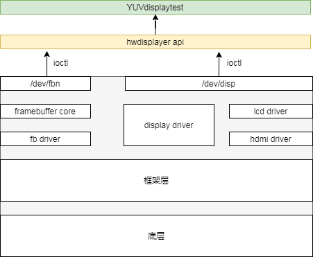

# 概述
# 文档简介
此文档为hwdisplay的使用说明文档。
# 相关人员
使用hwdisplay相关接口的开发人员。

# 模块概述

## hwdisplay简介
HwDisplay是T系列linux_sdk通过C++封装的一层接口。在摄像头、播放器中都使用了该接口来显示视频数据。

## 简要框架



display2显示系统可划分为三个层面，驱动层，框架层及底层。底层与图形硬件相接，主要负责将上层配置的功能参数转换成硬件所需要的参数，并配置到相应寄存器中。显示框架层对底层进行抽象封装成一个个的功能模块。驱动层对外封装功能接口，通过内核向用户空间提供相应的设备结点及统一的接口。在驱动层，分为四个驱动，分别是 framebuffer 驱动，disp 驱动，lcd 驱动，hdmi 驱动。Framebuffer驱动与 framebuffer core 对接，实现 linux 标准的 framebuffre 接口。Disp 驱动是是整个显示驱动中的核心驱动模块，所有的接口都由 disp 驱动来提供，包括 lcd 的接口以及 hdmi 的接口。


hwdisplay通过封装驱动层提供的接口，对应用程序提供相应简便易用的显示操作相关接口。

## 相关数据概念


# 常见接口详情

## getInstance
```cpp
static HwDisplay* getInstance();
```
* 作用：创建HwDisplay类
* 参数：无
* 返回：HwDisplay指针

示例：
```
HwDisplay* gVdecDisp = NULL;
gVdecDisp = HwDisplay::getInstance();
```
## hwd_screen1_init

```cpp
int hwd_screen1_init();
```
* 作用：初始化显示屏幕
* 参数：无
* 返回：
	- 0:成功
	- -1:失败

## aut_hwd_layer_request
```cpp
int aut_hwd_layer_request(struct view_info* surface,int screen_id,unsigned int channel,unsigned int layer_id);
```
* 作用：申请图层layer
* 参数：
  * surface:图层位置大小信息
  * screen_id：屏幕id
  * channel：通道id
  * layer_id：图层id
* 返回：
	- 0:成功
	- -1:失败
- demo

```cpp

int video_layer0 = -1;
HwDisplay* gVdecDisp = HwDisplay::getInstance();
struct view_info screen = {
            mParam->dispX,
            mParam->dispY,
            ALIGN(mParam->dispW, 32),
            ALIGN(mParam->dispH, 32)
        };

video_layer0 = gVdecDisp->aut_hwd_layer_request(&screen, SCR_ID_DEFAULT, mParam->chLID, mParam->lyrID);

```
## aut_hwd_layer_set_src
```cpp
int aut_hwd_layer_set_src(unsigned int hlay, struct src_info *src,unsigned long addr0,int share_fd = -1);
```
* 作用：设置源文件信息
* 参数：
  * haly:图层编号
  * *src：配置信息，宽、高和模式
  * addr0：通道id
  * share_fd：图层id
* 返回：
	- 0:成功
	- -1:失败
- demo

```cpp
struct src_info src;

src = { 
	ALIGN(src_w, 32), 
	ALIGN(src_h, 32), 
	DISP_PIXEL_FORMAT_DEFAULT };
ret = gVdecDisp->aut_hwd_layer_set_src(video_layer1, &src, (unsigned long)&addr, share_fd);

```
## aut_hwd_layer_set_rect
```cpp
int aut_hwd_layer_set_rect(unsigned int hlay, struct view_info *src_rect);
```
* 作用：设置图像源显示范围
* 参数：
  * haly:图层编号
  * *src_rect:位置配置信息
* 返回：
	- 0:成功
	- -1:失败
- demo

```cpp
struct view_info crop;

crop = { mParam->cropX, mParam->cropY, mParam->cropW, mParam->cropH };

ret = gVdecDisp->aut_hwd_layer_set_rect(video_layer0, &crop);

```

## aut_hwd_layer_set_zorder
```cpp
int aut_hwd_layer_set_zorder(unsigned int hlay,int zorder);
```
* 作用：设置图层叠加数值zorder
* 参数：
  * haly:图层编号
  * zorder:zorder值
* 返回：
	- 0:成功
	- -1:失败
- demo

```cpp

ret = gVdecDisp->aut_hwd_layer_set_zorder(video_layer0, mParam->zorder);
```
## aut_hwd_layer_open
```cpp
int aut_hwd_layer_open(unsigned int hlay);
```
* 作用：打开图层
* 参数：
  * haly:图层编号
* 返回：
	- 0:成功
	- -1:失败
- demo

```cpp
ret = gVdecDisp->aut_hwd_layer_open(video_layer0);
CHECK_DISP_RETURN(ret, "aut_hwd_layer_open");

```
## aut_hwd_layer_fb_mode
```cpp
int aut_hwd_layer_fb_mode(int screen_id,unsigned int type  ,unsigned int mode);
```
* 作用：设置fb模式
* 参数：
  * screen_id:屏幕编号
  * type:类型
  * mode:模式
* 返回：
	- 0:成功
	- -1:失败


## aut_hwd_layer_set_alpha
```cpp
int aut_hwd_layer_set_alpha(unsigned int hlay,int alpha_mode,int alpha_value);
```
* 作用：设置图层透明度
* 参数：
  * hlay:屏幕编号
  * alpha_mode:透明模式
  * alpha_value：透明度值
* 返回：
	- 0:成功
	- -1:失败
