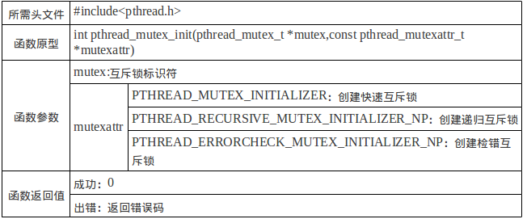
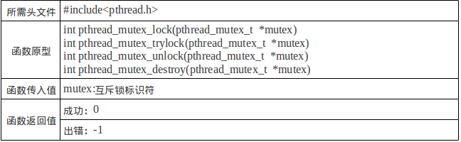
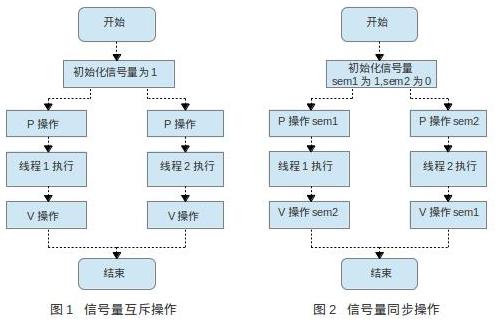
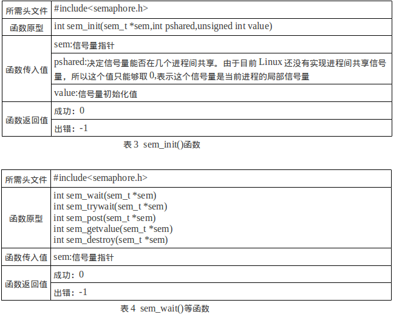
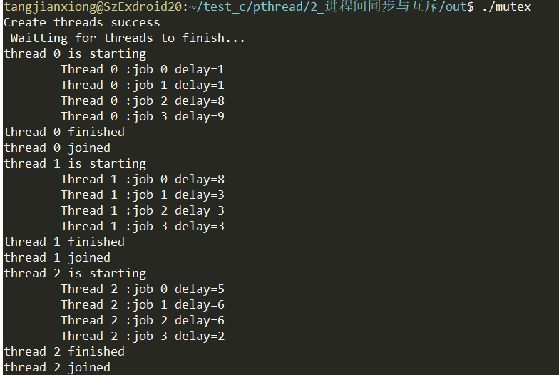

[toc]
# 线程间的同步与互斥

## 概述
由于线程共享进程的资源和地址空间，因此在对这些资源进行操作时，必须考虑到线程间资源访问的同步与互斥问题。这里主要介绍Posix中两种线程同步机制，分别为互斥锁和信号量。这两个同步机制可以通过互相调用对方来实现，但互斥锁更适用于同时可用的资源是唯一的情况；信号量更适用于同时可用的资源为多个的情况。
## 互斥锁
互斥锁是用一种简单的加锁方法来控制对共享资源的原子操作。这个互斥锁只有两种状态，即上锁和解锁，可以把互斥锁看做某种意义上的全局变量。在同一个时刻只能有一个线程掌握某个互斥锁，拥有上锁状态的线程能够对共享资源进行操作。若其他线程希望上锁一个已经被上锁的互斥锁，则该线程就会被挂起，直到上锁的线程释放掉互斥锁为止。可以说，这把互斥锁保证让每个线程对共享资源按顺序进行原子操作。  
互斥锁机制主要包括以下基本函数：  
●  互斥锁初始化：pthread_mutex_init()  
●  互斥锁上锁：pthread_mutex_lock()  
●  互斥锁判断上锁：pthread_mutex_trylock()  
●  互斥锁解锁：pthread_mutex_unlock()  
●  消除互斥锁：pthread_mutex_destroy()    





## 信号量
信号量就是操作系统中多用到的PV原子操作，它广泛应用于进程或线程间的同步与互斥。信号量本质上是一个非负的整数计数器，它被用来控制对公共资源的访问。这里先简单复习一下PV原子操作的工作原理。详细的请看博客：http://blog.csdn.net/mybelief321/article/details/9086151  

PV原子操作是对整数计数器信号量sem的操作。一次P操作使sem减1，而一次V操作使sem加1。进程（或线程）根据信号量的值来判断是否对公共资源具有访问权限。当信号量sem的值≥0时，该进程（或线程）具有公共资源的访问权限；相反，当信号量sem的值<0时，该进程（或线程）就将阻塞直到信号量sem的值≥0为止。

PV原子操作主要用于进程或线程间的同步和互斥这两种典型情况。若用于互斥，几个进程（或线程）往往只设置一个信号量sem，其操作流程如图1所示。当信号量用于同步操作时，往往会设置多个信号量，并安排不同的初始值来实现它们之间的顺序执行，其操作流程如图2所示。



Linux实现了Posix的无名信号量，主要用于线程间的互斥与同步。这里主要介绍几个常见函数：  
●  sem_init()用于创建一个信号量，并初始化它的值。  
●  sem_wait()和sem_trywait()都相当于P操作，在信号量>0时，它们能将信号量的值减1。两者的区别在于信号量<0时，sem_wait(0将会阻塞进程，而sem_trywait则会立即返回。  
●  sem_post()相当于V操作，它将信号量的值加1，同时发出信号来唤醒等待的进程。  
●  sem_getvalue()用于得到信号量的值。  
●  sem_destroy()用于删除信号量。  



# 实验1
+ 函数功能：让3个线程公用一个执行函数。每个线程都有四次循环（可看成4个小任务），每次循环会随机等待1~10s的时间，意义在于模拟每个任务的到达时间是随机的。现在使用互斥锁实现原本无序的多个线程按顺序执行。

+ 代码：thread_mutex.c

```
#include <stdio.h>
#include <stdlib.h>
#include <pthread.h>

#define THREAD_NUMBER 3        /*thread count*/
#define REPEAT_NUMBER 4        /*Number of subtasks*/
#define DELAY_TIME_LEVELS 10.0 /*time interval*/
pthread_mutex_t mutex;
void *thrd_func(void *arg)
{
    int thrd_num = (int)arg;
    int delay_time = 0, count = 0;
    int res;
    res = pthread_mutex_lock(&mutex);
    if (res)
    {
        printf("thread %d lock failed\n", thrd_num);
        pthread_exit(NULL);
    }
    printf("thread %d is starting\n", thrd_num);
    for (count = 0; count < REPEAT_NUMBER; count++)
    {
        delay_time = (int)(rand() * DELAY_TIME_LEVELS / (RAND_MAX) + 1);
        sleep(delay_time);
        printf("\tThread %d :job %d delay=%d\n", thrd_num, count, delay_time);
    }
    printf("thread %d finished\n", thrd_num);
    pthread_exit(NULL);
}
int main()
{
    pthread_t thread[THREAD_NUMBER];
    int no, res;
    void *thrd_ret;
    srand(time(NULL));
    /*mutex init*/
    pthread_mutex_init(&mutex, NULL);
    /*create threads*/
    for (no = 0; no < THREAD_NUMBER; no++)
    {
        res = pthread_create(&thread[no], NULL, thrd_func, (void *)no);
        if (res != 0)
        {
            printf("create thread %d failed\n", no);
            exit(res);
        }
    }
    printf("Create threads success \n Waitting for threads to finish...\n");
    /*Wait for the thread to end*/
    for (no = 0; no < THREAD_NUMBER; no++)
    {
        res = pthread_join(thread[no], &thrd_ret);
        if (!res)
        {
            printf("thread %d joined\n", no);
        }
        else
        {
            printf("thread %d join failed\n", no);
        }
        pthread_mutex_unlock(&mutex);
    }
}
```
+ 运行结果

