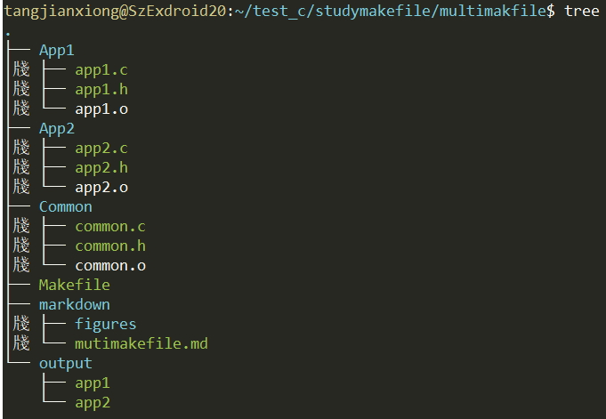
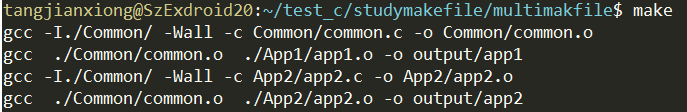

[toc]
# Makefile编译多个文件场景
在很多大型项目中，经常有这样的场景：多个应用程序同时共享某几个头文件。如果把这写应用程序分别用于一个文件夹管理就会显得很冗余。  
针对这个问题，完全可以把共用的代码放在一个文件夹，另外每个应用程序再独自放在自己的文件夹，编译的时候每个应用程序编译自己的文件及公用文件即可。

# 代码展示

## 文件结构



## 文件源码
+ common.h
```
#ifndef COMMON_H_
#define COMMON_H_

#define COMMON_VAR 1024

void common_fun();

#endif
```
+ common.c
```
#include <stdio.h>
#include "common.h"

void common_fun()
{
    printf("this is a common function.\n");
}

```
+ app1.h
```
#ifndef APP1_H_
#define APP1_H_

#define APP1_GREETING "this is app1"

#endif
```
+ app1.c
```
#include <stdio.h>
#include "../Common/common.h"
#include "app1.h"

int main()
{
    printf("hello, %s\n", APP1_GREETING);
    printf("common var is: %d\n", COMMON_VAR);
    common_fun();
    return 0;
}
```
+ app2.h
```
#ifndef APP2_H_
#define APP2_H_

#define APP2_GREETING "this is app2"

#endif
```
+ app2.c
```
#include <stdio.h>
#include "../Common/common.h"
#include "app2.h"

int main()
{
    printf("hello, %s\n", APP2_GREETING);
    printf("common var is: %d\n", COMMON_VAR);
    common_fun();
    return 0;
}
```
+ Makefile
```
NAME_APP1 = app1 
NAME_APP2 = app2 

TARGET = $(NAME_APP1) $(NAME_APP2)
SOURCE_COMMON = $(wildcard ./Common/*.c)
SOURCE_APP1 =$(SOURCE_COMMON) $(wildcard ./App1/*.c)
SOURCE_APP2 =$(SOURCE_COMMON) $(wildcard ./App2/*.c)

OBJ_APP1 = $(patsubst %.c, %.o, $(SOURCE_APP1))
OBJ_APP2 = $(patsubst %.c, %.o, $(SOURCE_APP2))

INCLUDE_COMMON = -I./Common/

CFLAGS = -Wall -c
CC = gcc

all: $(TARGET)
$(NAME_APP1):$(OBJ_APP1)
	@mkdir -p output/
	$(CC) $(OBJ_APP1) -o output/$(NAME_APP1)

$(NAME_APP2):$(OBJ_APP2)
	@mkdir -p output/
	$(CC) $(OBJ_APP2) -o output/$(NAME_APP2)

%.o: %.c 
	$(CC) $(INCLUDE_COMMON) $(CFLAGS) $< -o $@

.PHONY: clean
clean:
	rm -rf $(OBJ_APP1) $(OBJ_APP2) output/
```
# Makefile 编写思路
1. 使用wildcard函数将共用文件及各自的文件全部找出。各个应用程序还应加上共用文件，否则编译不过。
```

SOURCE_COMMON = $(wildcard ./00_Common/*.c)
SOURCE_APP1 = $(SOURCE_COMMON) $(wildcard ./01_Application1/*.c)
SOURCE_APP2 = $(SOURCE_COMMON) $(wildcard ./02_Application2/*.c)
```
2. 使用patsubst将应用程序的.c文件转化为.o文件，如下：
```
OBJ_APP1 = $(patsubst %.c, %.o, $(SOURCE_APP1))
OBJ_APP2 = $(patsubst %.c, %.o, $(SOURCE_APP2))
```

3. 加上共用头文件路径：
```
INCLUDE_COMMON = -I./Common/
```
4. 编写规则：

```
all: $(TARGETS)	#主要目标为所有将要编译的程序
$(NAME_APP1): $(OBJ_APP1)	#各个要编译的目标，依赖从以上几步已经获取完毕
        @mkdir -p output/
        $(CC) $(OBJ_APP1) -o output/$(NAME_APP1)
 
$(NAME_APP2): $(OBJ_APP2)
        @mkdir -p output/
        $(CC) $(OBJ_APP2) -o output/$(NAME_APP2)
```

# 编译结果

