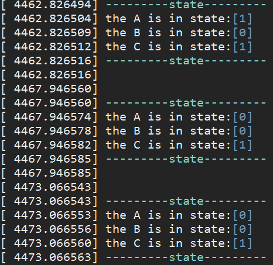

[TOC]

# 前言
进程是处于执行期的程序以及它所管理的资源（如打开的文件、挂起的信号、进程状态、地址空间等等）的总称。注意，程序并不是进程，实际上两个或多个进程不仅有可能执行同一程序，而且还有可能共享地址空间等资源。  
Linux内核通过一个被称为进程描述符的task_struct结构体来管理进程，这个结构体包含了一个进程所需的所有信息。它定义在linux/sched.h文件中。  
## 进程的简要定义
+ 一个正在执行的程序。
+ 一个正在计算机上执行的程序实例。  
+ 能分配给处理器并由处理器执行的实体。  
+ 一个具有以下特征的活动单元：一组指令序列的执行、一个当前状态和相关的系统资源集合。
##  相关特征
也可以把进程当成由一组元素组成的实体，进程的两个基本元素是程序代码（可能被执行相同程序的其他进程共享）和与代码相关联的数据集。假设处理器开始执行该程序代码，且我们把这个执行实体称为进程。在进程执行时，任意给的一个时间，进程都可以唯一地被表征为以下元素：
+ 标识符：跟这个进程相关的唯一标识符，用来区别其他进程。  
+ 状态：如果进程正在执行，那么进程处于执行状态。  
+ 优先级：相对于其他进程的优先级。  
+ 程序计数器：程序中即将被执行的下一条指令的地址。  
+ 内存指针：包括程序代码和进程相关数据的指针，还有和其他进程共享的内存块的指针。  
+ 上下文数据：进程执行时处理器的寄存器中的数据。   
+ I／O状态信息：包括显示的I/O请求,分配给进程的I／O设备（如磁带驱动器）和被进程使用的文件列表。 
+ 审计信息：可包括处理器时间总和，使用的时钟数总和，时间限制，审计号等。
上述信息被存放在一个称为进程控制块（PCB）的数据结构中，该控制块由操作系统创建和管理。每个进程在内核中都有一个进程控制块（PCB）来维护进程相关的信息，在Linux下内核的进程控制块就是task_struct结构体。  

# 进程的标识
```
pid_t pid;//进程的唯一标识
pid_t tgid;// 线程组的领头线程的pid成员的值
```
32位无符号整型数据。但最大值取32767。表示每一个进程的标识符。也是内核提供给用户程序的借口，用户程序通过pid操作程序。因为Unix的原因引入还引入了线程组的概念。称为：tgid。一个线程组中的所有线程使用和该线程组中的第一个轻量级线程的pid，被存在tgid成员中。当进程没有线程时，tgid=pid；当有多线程时，tgid表示的是主线程的id，而pid表示每一个线程自己的id。

# 进程状态

```
volatile long state;  
int exit_state;  
```

state成员的可能取值如下： 
```
#define TASK_RUNNING        0  //进程要么正在执行，要么正要准备执行
#define TASK_INTERRUPTIBLE  1  //进程被阻塞（睡眠），直到某个条件变为真
#define TASK_UNINTERRUPTIBLE    2  //与TASK_INTERRUPTIBLE类似，除了不能通过接受一个信号来唤醒以外
#define __TASK_STOPPED      4  //进程被停止执行
#define __TASK_TRACED       8  //进程被debugger等进程监视
/* in tsk->exit_state */     
#define EXIT_ZOMBIE     16  //表示进程的执行被终止，但是其父进程还没有使用wait()等系统调用来获知它的终止信息
#define EXIT_DEAD       32  //进程的最终状态
/* in tsk->state again */  
#define TASK_DEAD       64  
#define TASK_WAKEKILL       128  
#define TASK_WAKING     256 
```

# 进程优先级  long priority
Priority的值给出进程每次获取CPU后可使用的时间（按jiffies计）。优先级可通过系统sys_setpriorty改变（在kernel/sys.c中）。
+ 程序计数器：程序中即将被执行的下一条指令的地址。
+ 内存指针：包括程序代码和进程相关数据的指针，还有和其他进程共享的内存块的指针。
+ 上下文数据：进程执行时处理器的寄存器中的数据。 
+ I／O状态信息：包括显示的I/O请求,分配给进程的I／O设备（如磁带驱动器）和被进程使用的文件列表。 
+ 审计信息：可包括处理器时间总和，使用的时钟数总和，时间限制，审计号等。 

# 进程调度信息 
表示当前进程或一个进程允许运行的时间，待到该进程的时间片运行结束，CPU会从运行队列上拿出另一个进程运行。

+ need_resched：调度标志
+ Nice：静态优先级
+ Counter：动态优先级；重新调度进程时会在run_queue中选出Counter值最大的进程。也代表该进程的时间片，运行中不断减少。
+ Policy：调度策略开始运行时被赋予的值
+ rt_priority：实时优先级

# 进程通信有关信息（IPC：Inter_Process Communication）
+ unsigned long signal：进程接收到的信号。每位表示一种信号，共32种。置位有效。
+ unsigned long blocked：进程所能接受信号的位掩码。置位表示屏蔽，复位表示不屏蔽。
+ Spinlock_t sigmask_lock：信号掩码的自旋锁
+ Long blocked：信号掩码
+ Struct sem_undo *semundo：为避免死锁而在信号量上设置的取消操作
+ Struct sem_queue *semsleeping：与信号量操作相关的等待队列
+ struct signal_struct *sig：信号处理函数

# 进程信息
inux中存在多进程，而多进程中进程之间的关系可能是父子关系，兄弟关系。  
除了祖先进程外，其他进程都有一个父进程，通过folk创建出子进程来执行程序。除了表示各自的pid外，子进程的绝大多数信息都是拷贝父进程的信息。且父进程对子进程手握生杀大权，即子进程时是父进程创建出来的，而父进程也可以发送命令杀死子进程。  

# 时间信息
+ Start_time：进程创建时间
+ Per_cpu_utime：进程在执行时在用户态上耗费的时间。
+ Pre_cpu_stime：进程在执行时在系统态上耗费的时间。
+ ITIMER_REAL：实时定时器，不论进程是否运行，都在实时更新。
+ ITIMER_VIRTUAL：虚拟定时器，只有进程运行在用户态时才会更新。
+ ITIMER_PROF：概况定时器，进程在运行处于用户态和系统态时更新。

# 文件信息

文件的打开和关闭都是资源的一种操作，Linux中的task_struct中有两个结构体储存这两个信息。  
+ Sruct fs_struct *fs：进程的可执行映象所在的文件系统，有两个索引点，称为root和pwd，分别指向对应的根目录和当前目录。  
+ Struct files_struct *files：进程打开的文件

# 地址空间/虚拟内存信息
每个进程都有自己的一块虚拟内存空间，用mm_struct来表示，mm_struct中使用两个指针表示一段虚拟地址空间，然后在最终时通过页表映射到真正的物理内存上。

# 页面管理信息
+ Int swappable：进程占用的内存页面是否可换出。
+ Unsigned long min_flat,maj_flt,nswap：进程累计换出、换入页面数。
+ Unsigned long cmin_flat,cmaj_flt,cnswap：本进程作为祖先进程，其所有层次子进程的累计换出、换入页面数。

# 对称对处理机信息
+ Int has_cpu： 进程是否当前拥有CPU
+ Int processor： 进程当前正在使用的CPU
+ Int lock_depth： 上下文切换时内核锁的深度

# 上下文信息：
+ struct desc_struct *ldt：进程关于CPU段式存储管理的局部描述符表的指针。
+ struct thread_struct tss：任务状态段。与Intel的TSS进行互动，当前运行的TSS保存在PCB的tss中，新选中的的进程的tss保存在TSS。

# 信号量数据成员
+ struct sem_undo \*semundo：进程每一次操作一次信号量，都会生成一个undo操作。保存在sem_undo结构体中，最终在进程异常终止结束的时候，sem_undo的成员semadj就会指向一个数组，这个数组中每个成员都表示之前每次undo的量。
+ truct sem_queue *semsleeping：进程在操作信号量造成堵塞时，进程会被送入semsleeping指示的关于该信号量的sem_queue队列。

# 进程队列指针

+ struct task_struct \*next_task，\*prev_task：所有进程均有各自的PCB。且各个PCB会串在一起，形成一个双向链表。其next_task和prev_task就表示上一个或下一个PCB，即前后指针。进程链表的头和尾都是0号进程。
+ struct task_struct \*next_run，\*prev_run：由进程的run_queue中产生作用的，指向上一个或下一个可运行的进程，链表的头和尾都是0号进程。
+ struct task_struct \*p_opptr：原始父进程（祖先进程）
+ struct task_struct *p_pptr ：父进程
+ struct task_struct *p_cptr：子进程
+ struct task_struct *p_ysptr：弟进程
+ struct task_struct *p_osptr：兄进程
　以上分别是指向原始父进程(original parent)、父进程(parent)、子进程(youngest child)及新老兄弟进程(younger sibling，older sibling)的指针。

+ current：当前正在运行进程的指针。
+ struct task_struct init_task：0号进程的PCB，进程的跟=根，始终是INIT_TASK。
+ char comm[16]：进程正在执行的可执行文件的文件名。
+ int errno：进程最后一次出错的错误号。0表示无错误。

# 实验
## 程序内容
内核模块开辟一个线程，查看相关应用进程的信息，将进程信息打印出来。

## 代码
```
#include <linux/init.h>
#include <linux/module.h>
#include <linux/sched.h>
#include <linux/moduleparam.h>
#include <linux/string.h>
#include <linux/delay.h>
#include <linux/sched.h>
#include <linux/kthread.h>
#include <linux/err.h>
#include <linux/string.h>
static struct task_struct *test_task;
static int get_state_i = 1;
static int thread_get_pstate(void *data)
{
    int state_a = 0;
    int state_b = 0;
    int state_c = 0;
    struct task_struct *p;
    printk(KERN_INFO "Hello,world!\n");
    while (get_state_i)
    {
        for_each_process(p)
        {
            if (strcmp(p->comm, "server_a") == 0)
            {
                state_a = p->state;
            }
            if (strcmp(p->comm, "client_b") == 0)
            {
                state_b = p->state;
            }
            if (strcmp(p->comm, "client_c") == 0)
            {
                state_c = p->state;
            }
            // if ((strcmp(p->comm, "client_b") == 0) || (strcmp(p->comm, "client_c") == 0) || (strcmp(p->comm, "server_a") == 0))
            // {
            //     printk(KERN_INFO "the process is \"%s\" (pid %i),and process status is  %ld\n", p->comm, p->pid, p->state);
            // }
                }
        ssleep(5);
    }

    return 0;
}
static int hello_init(void)
{
    int err;
    test_task = kthread_create(thread_get_pstate, NULL, "test_task");

    if (IS_ERR(test_task))
    {
        printk("Unable to start kernel thread.\n");
        err = PTR_ERR(test_task);
        test_task = NULL;
        return err;
    }
    wake_up_process(test_task);
    return 0;
}

static void hello_exit(void)
{
    printk(KERN_INFO "GOODbye ,world\n");
    get_state_i = 0;
    kthread_stop(test_task);
    test_task = NULL;
}

module_init(hello_init);
module_exit(hello_exit);
MODULE_LICENSE("Dual BSD/GPL");
```

## 运行结果



