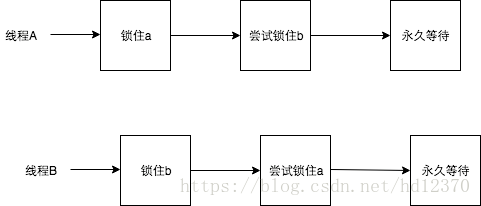
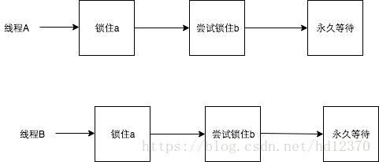
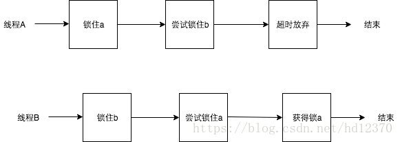

# 什么是死锁，产生死锁的原因及必要条件
## 什么是死锁？
所谓死锁，是指多个进程在运行过程中因争夺资源而造成的一种僵局，当进程处于这种僵持状态时，若无外力作用，它们都将无法再向前推进。 因此我们举个例子来描述，如果此时有一个线程A，按照先锁a再获得锁b的的顺序获得锁，而在此同时又有另外一个线程B，按照先锁b再锁a的顺序获得锁。如下图所示：

## 产生死锁的原因
### 竞争资源
系统中的资源可以分为两类：  
**可剥夺资源**，是指某进程在获得这类资源后，该资源可以再被其他进程或系统剥夺，CPU和主存均属于可剥夺性资源；  
**不可剥夺资源**，当系统把这类资源分配给某进程后，再不能强行收回，只能在进程用完后自行释放，如磁带机、打印机等。  

产生死锁中的竞争资源之一指的是竞争不可剥夺资源（例如：系统中只有一台打印机，可供进程P1使用，假定P1已占用了打印机，若P2继续要求打印机打印将阻塞）。 

产生死锁中的竞争资源另外一种资源指的是竞争临时资源（临时资源包括硬件中断、信号、消息、缓冲区内的消息等），通常消息通信顺序进行不当，则会产生死锁。
### 进程间推进顺序非法

若P1保持了资源R1,P2保持了资源R2，系统处于不安全状态，因为这两个进程再向前推进，便可能发生死锁
例如，当P1运行到P1：Request（R2）时，将因R2已被P2占用而阻塞；当P2运行到P2：Request（R1）时，也将因R1已被P1占用而阻塞，于是发生进程死锁

## 产生死锁的必要条件：
+ 互斥条件：进程要求对所分配的资源进行排它性控制，即在一段时间内某资源仅为一进程所占用。
+ 请求和保持条件：当进程因请求资源而阻塞时，对已获得的资源保持不放。
+ 不剥夺条件：进程已获得的资源在未使用完之前，不能剥夺，只能在使用完时由自己释放。
+ 环路等待条件：在发生死锁时，必然存在一个进程--资源的环形链。
## 解决死锁的基本方法
### 预防死锁：
资源一次性分配：一次性分配所有资源，这样就不会再有请求了：（破坏请求条件）
只要有一个资源得不到分配，也不给这个进程分配其他的资源：（破坏请保持条件）
可剥夺资源：即当某进程获得了部分资源，但得不到其它资源，则释放已占有的资源（破坏不可剥夺条件）
资源有序分配法：系统给每类资源赋予一个编号，每一个进程按编号递增的顺序请求资源，释放则相反（破坏环路等待条件）
### 以确定的顺序获得锁

如果必须获取多个锁，那么在设计的时候需要充分考虑不同线程之前获得锁的顺序。按照上面的例子，两个线程获得锁的时序图如下：

如果此时把获得锁的时序改成：

那么死锁就永远不会发生。 针对两个特定的锁，开发者可以尝试按照锁对象的hashCode值大小的顺序，分别获得两个锁，这样锁总是会以特定的顺序获得锁，那么死锁也不会发生。问题变得更加复杂一些，如果此时有多个线程，都在竞争不同的锁，简单按照锁对象的hashCode进行排序（单纯按照hashCode顺序排序会出现“环路等待”），可能就无法满足要求了，这个时候开发者可以使用银行家算法，所有的锁都按照特定的顺序获取，同样可以防止死锁的发生，该算法在这里就不再赘述了，有兴趣的可以自行了解一下。

### 超时放弃

当使用synchronized关键词提供的内置锁时，只要线程没有获得锁，那么就会永远等待下去，然而Lock接口提供了boolean tryLock(long time, TimeUnit unit) throws InterruptedException方法，该方法可以按照固定时长等待锁，因此线程可以在获取锁超时以后，主动释放之前已经获得的所有的锁。通过这种方式，也可以很有效地避免死锁。 还是按照之前的例子，时序图如下：

## 避免死锁:
预防死锁的几种策略，会严重地损害系统性能。因此在避免死锁时，要施加较弱的限制，从而获得 较满意的系统性能。由于在避免死锁的策略中，允许进程动态地申请资源。因而，系统在进行资源分配之前预先计算资源分配的安全性。若此次分配不会导致系统进入不安全的状态，则将资源分配给进程；否则，进程等待。其中最具有代表性的避免死锁算法是银行家算法。
银行家算法：首先需要定义状态和安全状态的概念。系统的状态是当前给进程分配的资源情况。因此，状态包含两个向量Resource（系统中每种资源的总量）和Available（未分配给进程的每种资源的总量）及两个矩阵Claim（表示进程对资源的需求）和Allocation（表示当前分配给进程的资源）。安全状态是指至少有一个资源分配序列不会导致死锁。当进程请求一组资源时，假设同意该请求，从而改变了系统的状态，然后确定其结果是否还处于安全状态。如果是，同意这个请求；如果不是，阻塞该进程知道同意该请求后系统状态仍然是安全的。
## 检测死锁
首先为每个进程和每个资源指定一个唯一的号码；
然后建立资源分配表和进程等待表。
解除死锁:
当发现有进程死锁后，便应立即把它从死锁状态中解脱出来，常采用的方法有：

### 剥夺资源
从其它进程剥夺足够数量的资源给死锁进程，以解除死锁状态；
### 撤消进程
可以直接撤消死锁进程或撤消代价最小的进程，直至有足够的资源可用，死锁状态.消除为止；所谓代价是指优先级、运行代价、进程的重要性和价值等。

参考博文：
<https://blog.csdn.net/jonnyhsu_0913/article/details/79633656>
<https://blog.csdn.net/sinat_21043777/article/details/53457233>
<https://blog.csdn.net/wsq119/article/details/82218911>